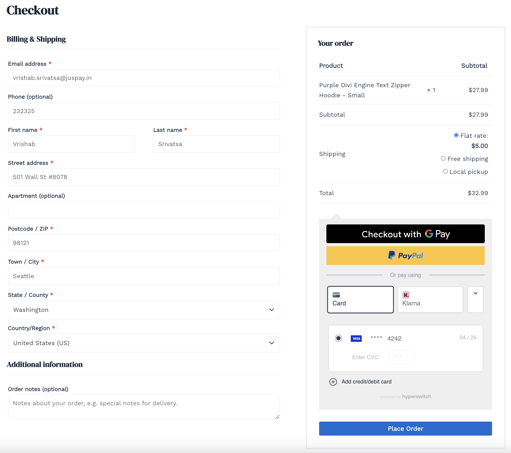
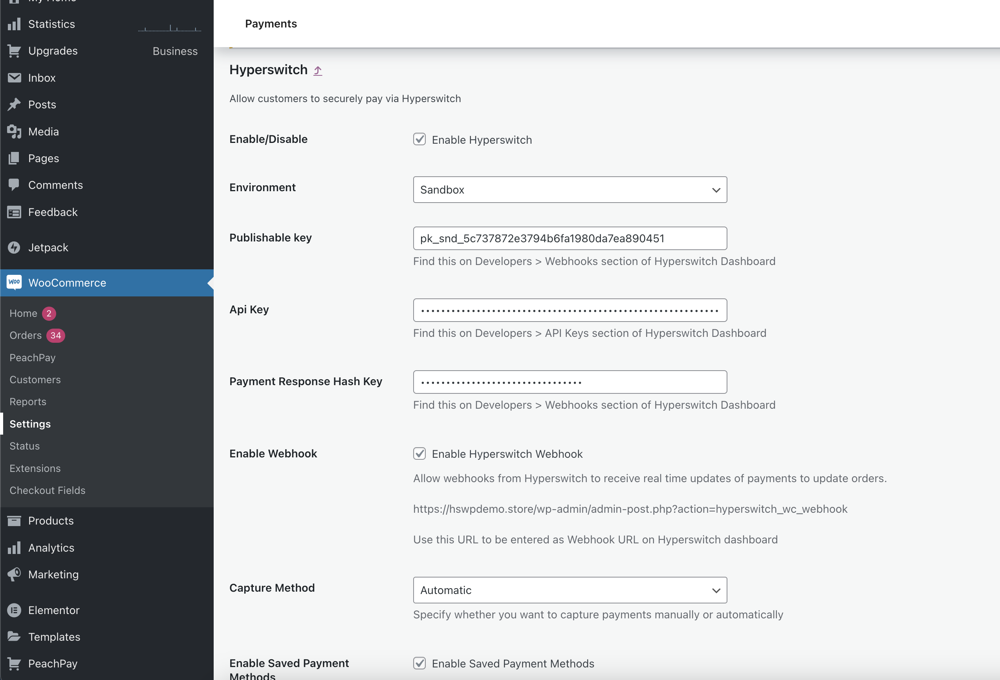

=== Payglo Checkout for WooCommerce ===
Contributors: payglo, vrishabjuspay
Tags: woocommerce, payglo, payment, ecommerce, e-commerce, checkout
Requires at least: 4.0
Tested up to: 6.2.1
Stable tag: 1.0.0
Requires PHP: 7.0
WC requires at least: 4.0.0
WC tested up to: 8.0.2
License: GPLv2 or later
License URI: http://www.gnu.org/licenses/gpl-2.0.html

== Description ==

**Future-proof woocommerce checkout plugin for startups and growing businesses**

*“Getting ganked by one payment processor for excessive risk/chargebacks and struggling to switch to another is guaranteed to get you some real quick business lessons.”*

**Problem: Woocommerce plugins which solve for checkout experience are not really payment processor agnostic**

If your payouts are blocked by the payment processor, your business comes to a standstill. You do not have an alternative option to ensure business continuity. 

And, of course there are some Woocommerce plugins which solve the above problem, but they are not PCI compliant to store credit card data. So, your customers’ credit cards are tokenized and stored with a single payment processor!! 

== Payglo for Woocommerce is a checkout plugin which offers: ==
- **Embedded checkout experience** across 40+ processors and 80+ payment methods 
- **PCI Compliant** to store credit/debit card data
- **Smart routing engine** to define business rules to optimize your payment cost and boost conversion rates.
- **Single unified dashboard** for analytics and refunds
- **Automatic retries** to enhance conversion rate
- **Local payment methods** for your customers to pay
- **Native payment experience** for a better payment experience
- **SDK Integrations** to support your business when it grows
- **Fraud and risk management** to reduce chargebacks

And it is absolutely **free** for upto 10,000 transactions per month !!!

**Customize your Payment Experience**
This plugin is built to seamlessly tailor the payment experience to match your website’s branding by blending the payment sheet into your WordPress theme. If you wish to, you can further customize the “Appearance” and “Layout” of the payment sheet using styles or pre-built themes.

**Pay Now**
Accept full payments at checkout with multiple payment methods, such as credit/debit card, wallets or pay-later.

**Manual Capture**
You can choose to capture customer payments automatically or manually, as per your needs. Once a customer authorizes their payment, you can easily capture payments manually through the Woocommerce Dashboard.

**Refunds**
In cases where you need to issue a refund to a customer, the Payglo plugin streamlines this process within your Woocommerce Dashboard.

**Sync Payments**
With the Payglo plugin integrated into your Woocommerce Dashboard, you have the flexibility to manually sync payment status whenever necessary. This feature allows you to ensure accurate payment status representation and maintain consistent order management.

**Real-time Order Updates**
Payglo facilitates seamless order updates through webhooks, allowing you to automate various order management processes. By setting up webhooks within your Payglo Plugin Settings and configuring the necessary endpoints in your Payglo Dashboard, you can receive real-time notifications about order status changes, payment confirmations, and more.

**PCI compliant**
The Payglo plugin comes with PCI compliance. So your customer’s cards are secured in a private card vault and not stored/tokenized with any payment processor. If and when you decide to move out of WooCommerce, you carry your cards on file and recurring payment tokens with you.

**Smart Routing Engine**
Payglo’s powerful routing engine gives the flexibility to route the transactions between processors to increase their conversion rate, decrease cost or any other business logic. 

**Unified Dashboard**
From a single unified dashboard, merchants can view their transaction analytics, complete refunds, manage subscriptions, understand the customer journey on their store and much more.

**Automatic Retries**
When a transaction fails via one processor, Payglo automatically tries to salvage it by routing it through another processor, whenever possible. This happens intelligently without your customer even knowing it happened in the background.

**Local Payment Methods**
Enabling local payment methods, alternative payment methods for your ever-growing customer base cannot be easier. You just need to tick a checkbox on the payglo control center and the payment method shows up for your customers in the relevant geographies, without any additional effort at your end. Historically, diverse local payment methods have been known to boost conversion rates for the merchants.

**Native Payment Experience**
We strive to enhance the payment experience for our customers. Be it avoiding redirections and promoting native payment experience, to supporting embedded payments, Payglo continuously tries to improve the payment experience for the customers and ensures uplift in the conversion rates for the merchants.

**SDK integrations**
Most of the Woocommerce payment plugins will support a merchant only on Woocommerce. Payglo has native SDKs, hosted checkout and api-integrations for merchants who want to build their own apps, for both web and mobile. 

**Fraud and Risk Management**
Payglo is integrated with leading third party fraud and risk management platforms like Signifyd, Riskified, etc. If you are burdened with increasing frauds and chargebacks, Payglo can help you reduce frauds and chargebacks.

== How to Get Started ==
 - Sign up for Payglo [here](https://app.payglo.io/)
 - Configure the Payglo settings under WooCommerce > Settings > Payments
 - Enter your Payglo API credentials and customize other settings as needed

== Installation ==

1. Upload plugin folder to to the "/wp-content/plugins/" directory.
2. Activate the plugin through the "Plugins" menu in WordPress.
3. Go to WooCommerce Settings –> Payments and configure your Payglo settings.
4. Read more about the configuration process in the [plugin documentation](https://payglo.io/docs/sdkIntegrations/wooCommercePlugin/wooCommercePluginOverview).

== Frequently Asked Questions ==

**Is my customer information shared with other plugin users?**
No. Payglo Woocommerce plugin does not share customer data across other plugin users. Yours customer’s cards will be stored in a PCI compliant card vault powered by Payglo.

**What will happen to my customers’ saved cards, if I move out of Payglo?**
If for any reason you happen to move out of Payglo, you will be facilitated with the process of migrating the cards to any PCI compliant entity as you might wish.

**Who built and maintains the plugin?**
The plugin is built and maintained by Juspay Technologies - a leading payment orchestrator processing 50 Million transactions per day and backed by funding from Accel Partners and Softbank.

**How can I customize the payment sheet as per my branding?**
The plugin ensures that the payment sheet automatically blends into the website’s theme by fetching the basic style attributes from the page. However, attributes of the payment sheet such as font family, text and background color etc can be customized by modifying the “Appearance” object present in the Payment settings. You may choose between Accordion and Tab Layouts as per your requirement.

**Is Payglo plugin compatible with my other plugins?**
Yes, this plugin can be used along with other plugins. However, we would advise not to use other payment plugins for a better checkout experience.

**How will I receive chargeback notifications?**
This feature is currently being developed by Payglo where any chargeback/refund notifications would be sent via Webhooks to your Wordpress server, which would then update the order status accordingly. Provided that Webhooks are enabled and Payment Response Hash Key is correctly configured, you would be able to receive these notifications realtime.

**How do I cancel orders and trigger refunds with the Payglo plugin?**
Orders can be refunded from the Orders Management section of your WP Admin dashboard. The order status is automatically updated to “Refunded”.

**Does the Payglo plugin support multiple languages?**
Currently, en-US is the only supported language.

**How much will Payglo charge me for using the plugin?**
Absolutely nothing! The Payglo plugin is free to use, and does not add any costs to your pricing plan. Find out more on pricing [here](https://payglo.io/pricing).

**How do I enable/ disable payment methods on the plugin?**
Different payment methods across Payment Processors can be enabled/disabled on the Payglo Dashboard.

== Changelog ==
**1.0.0**
* Initial release.

== Screenshots ==
1. 
   Unified Checkout Experience with Payglo

2. 
   Payglo Payment Settings on WooCommerce > Settings > Payments tab
